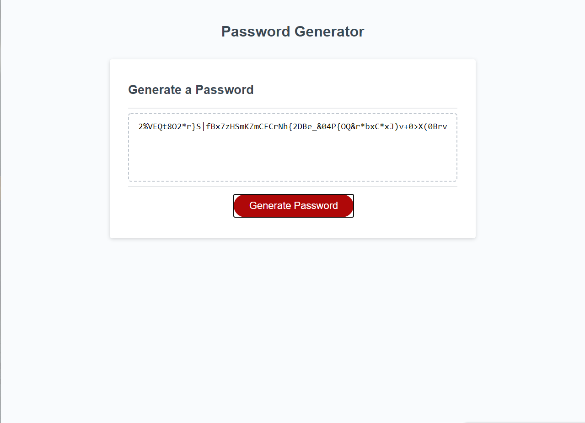

# password-generator

This assignment generates a random password from the criteria selected from the prompts. It features dynamically updating HTML and CSS powered by JavaScript code. The user is prompted to input the length of the password, if the password will include uppercase letters and lowercase letters, numeric values and special characters then the code generates a password based on those criteria and displays it on the screen.

## Credits

Special shoutout to Pete Kriengsiri for help with this homework. Here is the [link](https://github.com/pkriengsiri) to his GitHub

## Screenshot

## link to website

https://itsjustikenna.github.io/password-generator/

